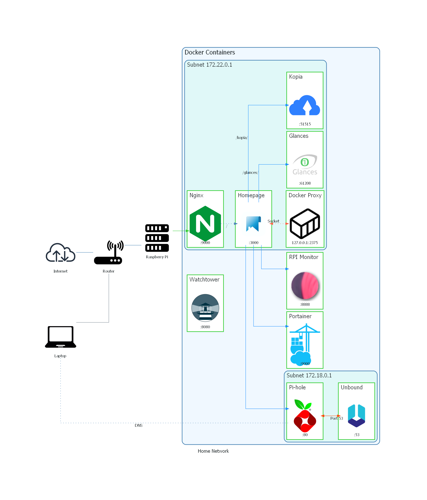

# Home Network Diagram

This repository contains a visual representation of my home network setup, illustrating the various components and their interactions. The diagram was created using the [diagrams](https://github.com/mingrammer/diagrams) Python library.

## Overview

The Raspberry Pi serves as the central server in my home network, running the following Docker [containers](./containers/):
- **Portainer**: A Docker management UI.
- **Pi-hole**: A network-wide ad blocker.
- **Unbound**: A validating, recursive, caching DNS resolver.
- **Homepage**: A dashboard for accessing various services.
- **Nginx**: Acts as a reverse proxy for the Homepage service.
- **RPI Monitor**: Monitors the status of the Raspberry Pi.
