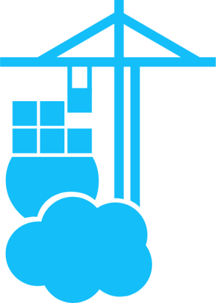

# Home Network Diagram

This repository contains a visual representation of my home network setup, illustrating the various components and their interactions. The diagram was created using the [diagrams](https://github.com/mingrammer/diagrams) Python library.

## Overview

The Raspberry Pi serves as the central server in my home network, running the following Docker [containers](./containers/):

<table>
    <tr>
        <td></td>
        <td><strong>Portainer</strong>: A Docker management UI.</td>
    </tr>
    <tr>
        <td></td>
        <td><strong>Pi-hole</strong>: A network-wide ad blocker.</td>
    </tr>
    <tr>
        <td></td>
        <td><strong>Unbound</strong>: A validating, recursive, caching DNS resolver.</td>
    </tr>
    <tr>
        <td></td>
        <td><strong>Homepage</strong>: A dashboard for accessing various services.</td>
    </tr>
    <tr>
        <td></td>
        <td><strong>Nginx</strong>: Acts as a reverse proxy for the Homepage service.</td>
    </tr>
    <tr>
        <td></td>
        <td><strong>RPI Monitor</strong>: Monitors the status of the Raspberry Pi.</td>
    </tr>
    <tr>
        <td></td>
        <td><strong>Watchtower</strong>: Automatically updates Docker containers.</td>
    </tr>
    <tr>
        <td></td>
        <td><strong>Glances</strong>: A system monitoring tool.</td>
    </tr>
    <tr>
        <td></td>
        <td><strong>Kopia</strong>: A backup tool for data management.</td>
    </tr>
    <tr>
        <td></td>
        <td><strong>Docker Proxy</strong>: Handles Docker socket connections.</td>
    </tr>
</table>
